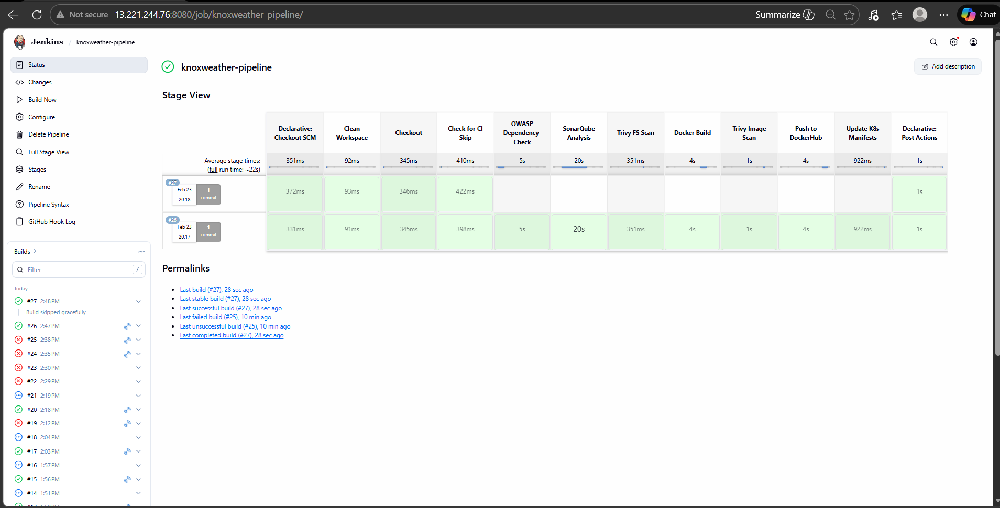
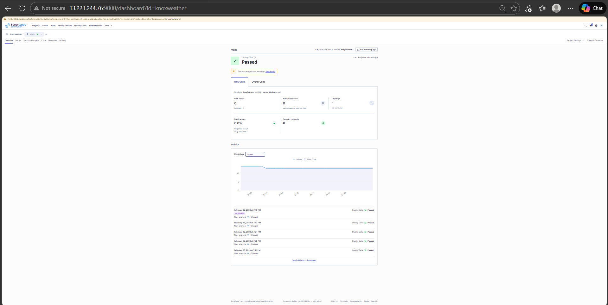
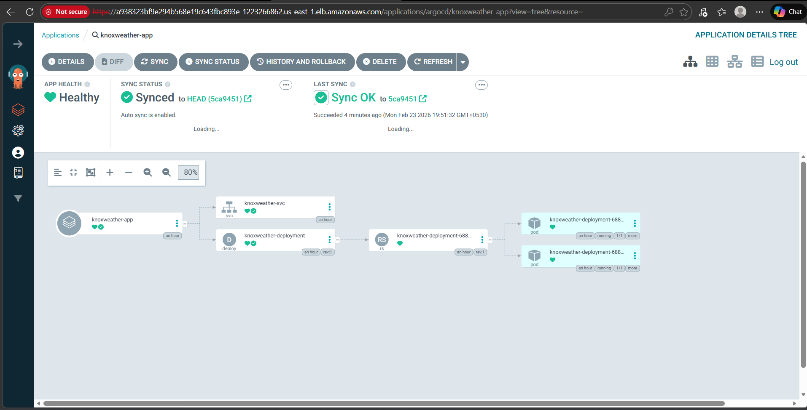

# 🌦️ ClimaEngineX — Weather App with GitOps CI/CD on AWS EKS

> Real-time weather app with a production-grade Jenkins CI/CD pipeline deploying to Kubernetes via ArgoCD GitOps.

<!-- Badges -->
<p align="center">
  <a href="https://www.python.org/"></a>
  <a href="https://flask.palletsprojects.com/"></a>
  <a href="https://www.docker.com/"></a>
  <a href="https://gunicorn.org/"></a>
</p>

<p align="center">
  <a href="https://www.jenkins.io/"></a>
  <a href="https://argoproj.github.io/cd/"></a>
  <a href="https://kubernetes.io/"></a>
  <a href="https://www.terraform.io/"></a>
</p>

<p align="center">
  <a href="https://www.sonarsource.com/products/sonarqube/"></a>
  <a href="https://trivy.dev/"></a>
  <a href="https://owasp.org/www-project-dependency-check/"></a>
  
</p>

---

## ✨ Highlights

| Feature               | Description                                      |
| --------------------- | ------------------------------------------------ |
| 🐳 **Dockerized**     | Containerized with Gunicorn production server    |
| 🔄 **Jenkins CI/CD**  | Multi-stage pipeline with shared libraries       |
| 🚀 **ArgoCD GitOps**  | Automatic deployment when manifests change       |
| ☸️ **AWS EKS**        | Kubernetes cluster with spot instances           |
| 🏗️ **Terraform IaC**  | Infrastructure provisioned as code               |
| 🔍 **Security Scans** | OWASP, SonarQube SAST, and Trivy container scans |
| 🔁 **CI Skip Logic**  | Prevents infinite webhook loops gracefully       |

---

## 🏗️ Architecture

```
Developer pushes code to GitHub
  │
  ├──► GitHub Webhook triggers Jenkins
  │
  ├──► Jenkins Pipeline (Declarative + Shared Libraries)
  │     ├── Clean Workspace
  │     ├── Git Checkout + CI Skip Check
  │     ├── OWASP Dependency-Check (SCA)
  │     ├── SonarQube Analysis (SAST)
  │     ├── Trivy Filesystem Scan
  │     ├── Docker Build & Push → DockerHub
  │     ├── Trivy Image Scan
  │     └── Update K8s Manifests (sed + git push [ci skip])
  │
  └──► ArgoCD detects manifest change
        ├── Pulls new image from DockerHub
        └── Deploys to AWS EKS cluster
```

### DevSecOps & GitOps Architecture

<p align="center">
  
</p>

---

## 📸 CI/CD Pipeline Screenshots

### Jenkins Pipeline

<p align="center">
  
</p>

### SonarQube Dashboard

<p align="center">
  
</p>

### ArgoCD Deployment

<p align="center">
  
</p>

---

## 📁 Project Structure

```
ClimaEngineX/
├── app.py                          # Flask application
├── Dockerfile                      # Container configuration
├── requirements.txt                # Python dependencies
├── templates/
│   └── index.html                  # Weather UI
├── static/
│   └── style.css                   # Styles
│
├── Jenkinsfile                     # Declarative pipeline (uses shared libs)
├── vars/                           # Jenkins Shared Library
│   ├── cleanWorkspace.groovy       # Workspace cleanup
│   ├── gitCheckout.groovy          # Git checkout
│   ├── ciSkipCheck.groovy          # CI skip detection
│   ├── owaspCheck.groovy           # OWASP Dependency-Check
│   ├── sonarAnalysis.groovy        # SonarQube SAST scan
│   ├── trivyScan.groovy            # Trivy security scan
│   ├── dockerBuildPush.groovy      # Docker build & push
│   └── updateK8sManifests.groovy   # K8s manifest update + git push
│
├── k8s/                            # Kubernetes manifests
│   ├── deployment.yaml             # App deployment (2 replicas)
│   └── service.yaml                # LoadBalancer service
│
├── terraform/                      # EC2 infrastructure (GitHub Actions)
│   ├── ec2.tf                      # EC2, VPC, Security Group
│   ├── variable.tf                 # Input variables
│   ├── output.tf                   # EC2 IP output
│   ├── provider.tf                 # AWS provider
│   └── terraform.tf                # S3 backend config
│
├── terraform-eks/                  # EKS + CI server infrastructure
│   ├── ec2.tf                      # Jenkins/SonarQube EC2 instance
│   ├── variable.tf                 # Variables
│   ├── output.tf                   # Outputs
│   ├── provider.tf                 # AWS provider
│   └── scripts/
│       ├── setup.sh                # Combined setup (Jenkins + Docker + SonarQube + Trivy)
│       ├── jenkins-setup.sh        # Jenkins standalone setup
│       └── sonar-setup.sh          # SonarQube standalone setup
│
├── .github/workflows/              # GitHub Actions (alternative CI/CD)
│   ├── deploy.yml                  # Build + Terraform + Deploy
│   └── destroy.yml                 # Destroy infrastructure
│
├── CICD-assests/                   # Pipeline screenshots
│   ├── jenkins-pipeline-final.png
│   ├── Jenkins-pipeline-before.png
│   ├── SonarQube.png
│   └── Argocd.png
│
├── assets/
│   └── architecture-climax.png     # Architecture diagram
│
├── .gitignore
├── .dockerignore
├── LICENSE
└── README.md
```

---

## 🔧 Jenkins Shared Library

The `vars/` directory contains reusable Groovy pipeline functions. Each file exports a `call()` method that the `Jenkinsfile` invokes directly.

| File                        | Purpose                                                         |
| --------------------------- | --------------------------------------------------------------- |
| `cleanWorkspace.groovy`     | Cleans Jenkins workspace before each build                      |
| `gitCheckout.groovy`        | Clones the repository from GitHub                               |
| `ciSkipCheck.groovy`        | Detects `[ci skip]` in commit message to prevent infinite loops |
| `owaspCheck.groovy`         | Runs OWASP Dependency-Check for known CVEs                      |
| `sonarAnalysis.groovy`      | Runs SonarQube static code analysis                             |
| `trivyScan.groovy`          | Runs Trivy scans (filesystem or Docker image)                   |
| `dockerBuildPush.groovy`    | Builds Docker image and pushes to DockerHub                     |
| `updateK8sManifests.groovy` | Updates `deployment.yaml` image tag and pushes to Git           |

> **How it works:** When this repo is configured as a Jenkins Pipeline Library, Jenkins loads the `vars/` folder automatically. Each `.groovy` file becomes a callable function in the `Jenkinsfile`.

---

## 🚀 Quick Start

### Run with Docker

```bash
docker pull rupeshs11/knoxweather:latest
docker run -d -p 80:5000 -e OPENWEATHER_API_KEY=your_key rupeshs11/knoxweather:latest
```

### Run Locally

```bash
git clone https://github.com/Rupeshs11/ClimaEngineX.git
cd ClimaEngineX
echo "OPENWEATHER_API_KEY=your_key" > .env
pip install -r requirements.txt
python app.py
```

---

## ☸️ Kubernetes Deployment

### Deploy to EKS

```bash
# Create EKS cluster
eksctl create cluster --name knoxweather-cluster --region us-east-1 \
  --node-type t3.small --nodes 2 --managed --spot

# Apply manifests
kubectl apply -f k8s/

# Get the load balancer URL
kubectl get svc knoxweather-svc
```

### ArgoCD Setup

```bash
# Install ArgoCD
kubectl create namespace argocd
kubectl apply -n argocd -f https://raw.githubusercontent.com/argoproj/argo-cd/stable/manifests/install.yaml

# Expose ArgoCD UI
kubectl patch svc argocd-server -n argocd -p '{"spec": {"type": "LoadBalancer"}}'

# Get admin password
kubectl -n argocd get secret argocd-initial-admin-secret -o jsonpath="{.data.password}" | base64 -d
```

---

## 🏗️ Terraform

This project includes two Terraform configurations:

| Directory        | Purpose                                | Resources                                           |
| ---------------- | -------------------------------------- | --------------------------------------------------- |
| `terraform/`     | EC2 deployment via GitHub Actions      | EC2, VPC, Security Group, S3 backend                |
| `terraform-eks/` | EKS CI/CD server (Jenkins + SonarQube) | EC2 (m7i-flex.large), Security Group, setup scripts |

### Key Commands

```bash
cd terraform-eks    # or cd terraform
terraform init
terraform plan
terraform apply
terraform destroy   # Always destroy to avoid charges!
```

---

## 🛠️ Jenkins Setup

### Required Jenkins Plugins

| Plugin                 | Purpose                    |
| ---------------------- | -------------------------- |
| OWASP Dependency-Check | SCA vulnerability scanning |
| SonarQube Scanner      | Static code analysis       |
| Docker Pipeline        | Docker build support       |
| Pipeline Utility Steps | Pipeline utilities         |

### Required Jenkins Credentials

| Credential ID     | Type              | Description                             |
| ----------------- | ----------------- | --------------------------------------- |
| `dockerhub-creds` | Username/Password | DockerHub login                         |
| `sonar-token`     | Secret text       | SonarQube authentication token          |
| `github-creds`    | Username/Password | GitHub PAT for pushing manifest changes |

---

## 🔧 App Features

| Feature                    | Description                       |
| -------------------------- | --------------------------------- |
| 🌡️ **Real-time Weather**   | Live data from OpenWeatherMap API |
| 🏙️ **City Search**         | Search any city worldwide         |
| 🌅 **Sunrise/Sunset**      | Display sunrise and sunset times  |
| 💨 **Wind Info**           | Speed and direction               |
| 💧 **Humidity & Pressure** | Atmospheric data                  |
| ❤️ **Health Check**        | `/health` endpoint for monitoring |

---

## 🤝 Tech Stack

| Technology         | Purpose                                      |
| ------------------ | -------------------------------------------- |
| **Flask**          | Web framework                                |
| **Gunicorn**       | Production WSGI server                       |
| **Docker**         | Containerization                             |
| **Jenkins**        | CI/CD pipeline orchestration                 |
| **ArgoCD**         | GitOps continuous delivery                   |
| **AWS EKS**        | Managed Kubernetes                           |
| **Terraform**      | Infrastructure as Code                       |
| **SonarQube**      | Static code analysis (SAST)                  |
| **Trivy**          | Container & filesystem vulnerability scanner |
| **OWASP DC**       | Software composition analysis (SCA)          |
| **Docker Hub**     | Container registry                           |
| **OpenWeatherMap** | Weather data API                             |

---

## 🧹 Cleanup

### Delete EKS Cluster

```bash
kubectl delete namespace argocd
eksctl delete cluster --name knoxweather-cluster --region us-east-1
```

### Destroy Terraform Resources

```bash
cd terraform-eks && terraform destroy -auto-approve
cd terraform && terraform destroy -auto-approve
```

> ⚠️ **Always terminate unused AWS resources to avoid charges!**

---

<p align="center">
  <i>Push to main → Jenkins scans, builds, pushes → ArgoCD deploys to EKS. That's GitOps.</i>
</p>
